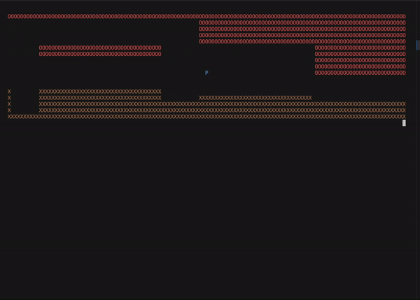
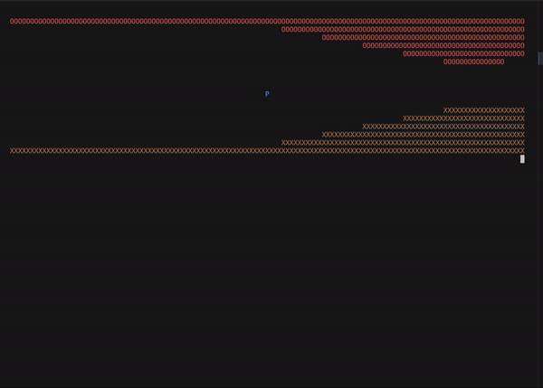

# ENGG1340-group-project

## first time:
```bash
git clone https://github.com/tracy308/ENGG1340-group-project.git
```

## to update files:
``` bash
git pull 
# pull from the main branch to update any file changes from other people

git add -A
# add files to commit

git status
# to see which file are modified/created

git commit -m "<short summary of what you did>"
# write a short message, usually starting with fix: (fix bug), feat: (feature), etc.

git push
# push your changes to the branch
```

## Run File
``` bash
make
./rs
make clean
```

## Block Dash

In Block Dash, your goal is to guide the player character, represented by the letter 'P', through a series of randomly generated maps. The maps are filled with obstacles represented by brown or red blocks. The player must navigate through the map and reach the bottom without colliding with any obstacles. 

## Table of Contents

- [Installation](#installation)
- [Usage](#usage)
- [Controls](#controls)
- [Gameplay](#gameplay)
- [Screenshots](#screenshots)

## Installation

1. Install the required dependencies:
   - `ncurses` library from blockdash.cpp

2. Clone the repository:

   ```bash
   git clone https://github.com/your-username/block-dash.git
   ```

3. Compile the code:

   ```bash
   g++ blockdash.cpp -o block-dash -lncurses
   ```

## Usage

1. Run the game:

   ```bash
   ./block-dash
   ```

2. Follow the on-screen instructions to play the game.

## Controls

- Press the spacebar to make the player character move up.
- If no key is pressed, the player character moves down automatically.

## Gameplay

- At the start of each stage, a random map is generated from a set of 10 maps (1.txt-10.txt).
- The player character is represented by the letter 'P' and starts at the top of the map.
- The map consists of obstacles represented by brown or red blocks.
- The player's objective is to navigate through the map and reach the bottom without colliding with any obstacles.
- If the player character collides with an obstacle, the game ends, and the player loses.
- If the player successfully reaches the bottom of the map, they win the game, and a win screen is displayed.
- After the win screen, the game moves on to the next stage with a new random map.

## Sample Runs





I hope this README provides a detailed overview of your Block Dash game. Let me know if you have any further questions!
