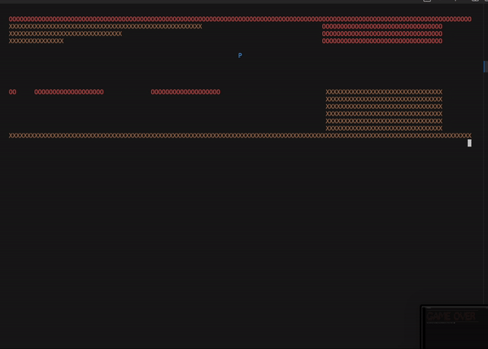

# ENGG1340-group-project

## Set Up
```bash
git clone https://github.com/tracy308/ENGG1340-group-project.git
```

## Update Files
``` bash
git pull 
# pull from the main branch to update any file changes from other people

git add -A
# add files to commit

git status
# to see which file are modified/created

git commit -m "<short summary of what you did>"
# write a short message, usually starting with fix: (fix bug), feat: (feature), etc.

git push
# push your changes to the branch
```

## STAGE 1: Rotating Stones
In rotating stones, your goal is to kill the monster. The player has to connect stones of different types to defeat the monster. However, each round the monster will also attack the player, decreasing the player's health. When the player's health reaches 0, the player loses the game. On the contrary, if the monster's health drops to 0 or below, the player wins the stage.

## Run File
``` bash
make
./rs
```

## STAGE 2: Block Dash

In Block Dash, your goal is to guide the player character, represented by the letter 'P', through a series of randomly generated maps. The maps are filled with obstacles represented by brown or red blocks. The player must navigate through the map and reach the bottom without colliding with any obstacles. 

## Table of Contents

- [Installation](#installation)
- [Usage](#usage)
- [Controls](#controls)
- [Gameplay](#gameplay)
- [Screenshots](#screenshots)
- [Features](#features)

## Installation

1. Install the required dependencies:
   - `ncurses` library from blockdash.cpp

2. Clone the repository:

   ```bash
   git clone https://github.com/your-username/block-dash.git
   ```

3. Compile the code:

   ```bash
   g++ blockdash.cpp -o block-dash -lncurses
   ```

## Usage

1. Run the game:

   ```bash
   ./block-dash
   ```

2. Follow the on-screen instructions to play the game.

## Controls

- Press the spacebar to make the player character move up.
- If no key is pressed, the player character moves down automatically.

## Gameplay

- At the start of each stage, a random map is generated from a set of 10 maps (1.txt-10.txt).
- The player character is represented by the letter 'P' and starts at the top of the map.
- The map consists of obstacles represented by brown or red blocks.
- The player's objective is to navigate through the map and reach the bottom without colliding with any obstacles.
- If the player character collides with an obstacle, the game ends, and the player loses.
- If the player successfully reaches the bottom of the map, they win the game, and a win screen is displayed.
- After the win screen, the game moves on to the next stage with a new random map.

## Sample Runs




## Features 
1. Generation of random game sets or events:
  - Randomized map selection using the rand() and srand() functions.
2. Data structures for storing game status:
  - The mapData array is an array of strings that holds the complete map data. It will be accessed each time to retrieve the map portions that need to be printed. Additionally, it will be used to refer to when adding the player to the map and color the map accordingly.
  - The mapPortion array is used to store a portion of the map that will be printed on the terminal. It will also be utilized in the collision detection function to determine if the character located at the player's index represents an obstacle. If a collision occurs, it means that the player has collided with an obstacle and has lost the game.
3. File I/O:
  - Map contents loaded from a separate text file which is then read and stored in mapData array. 
  - Win and lose screens read from design files ("win.txt" and "lose.txt" respectively) and printed to adjust to terminal width accordingly.

## Non-standard C/C++ libraries used
- ncurses.h is used to implement the isSpaceBarPressed function, which allows continuous detection of the space bar without the need to press the enter key. When the space bar is pressed, the player character will move up by two blocks in the game.
